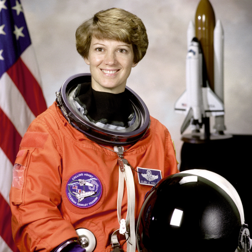

# About

This code was written for an image processing module that accepts RGB888 image with different resolution. 

To do so, an image is parsing into the filtee_mod.v (Verilog file - top level). 
RGB is spliting into 3 channel. All three chanels are parsing though sharpening filter kernel.
Then it saves in BMP format with the same resolution.

# Requirements

Verilog files were tested in Vivado and Modelsim. 

# Quick Start 

to run simulation 

    vsim -c -do run_sim.do

Soursed Image

Processed Image using FPGA

# To change Resolution

go to tb_filter_mod.v

change 

    `define soursed_image_name  "..."
    `define processed_image_name  "..."
    `define processed_image_hex  "..."

    ...
    parameter WIDTH = 8, 
    parameter DEPTH = 3840,
    parameter LINE_BITS = 14
    parameter ROWS =3840, 
    parameter COLS = 2160 

Soursed Image

Processed Image using FPGA

